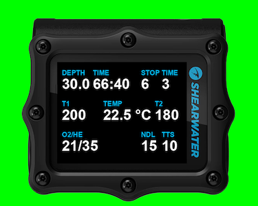
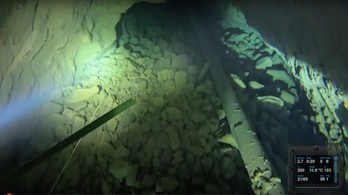

# Dive computer video overlay generator

A cross-platform Python tool that generates a **chroma key–ready dive computer overlay video** from a dive log file. Ideal for compositing depth, time, tank pressures, temperature, and stop information directly into your dive footage.

---

## 📑 Table of Contents

1. [Features](#-features)  
2. [Example Outputs](#-example-outputs)  
3. [Installation](#-installation)  
4. [Quick Start](#-quick-start)  
5. [Compositing into Final Video](#-compositing-the-overlay-into-your-dive-footage)  
6. [Command Reference](#-command-reference)  
7. [Creating & Editing Templates](#-creating--editing-templates)  
8. [Troubleshooting](#-troubleshooting)  
9. [Roadmap](#-roadmap)  
10. [License](#-license)  

---

## ✨ Features

### Computer Data Overlay
- **Multiple dive log formats** — Subsurface (.ssrf) and Shearwater XML
- **Flexible backgrounds** — solid color or PNG with transparency  
- **Chroma key–friendly** background color (default bright green `#00FF00`)  
- **Per-item positioning** — labels and values placed independently  
- **Rich data support** — depth, time, NDL, TTS, temperature, stop depth/time, gas, pressure[n]  
- **Computed fields** — combine multiple data fields with custom formatting
- **Automatic unit conversion** — metric ↔ imperial  
- **Per-item numeric precision** — e.g. 1 decimal for depth, integer for pressures  
- **Font customization** — size, color, style with automatic fallbacks  
- **Quick layout testing** — render a single PNG before committing to a video  
- **Multiple tank pressures** via indexed fields (`pressure[0]`, `pressure[1]`, …)  
- **Fallback values** for missing data  
- **Simple YAML configuration** — no code changes required for layout tweaks

### Dive Profile Graph Overlay
- **Visual depth profile** — graph showing depth over time with moving position indicator
- **Independent overlay** — generate profile separately from computer data for flexible compositing
- **Template-based styling** — customize colors, line thickness, indicator size via YAML
- **Grid and axes** — optional grid lines, axis labels, and tick marks for reference
- **Auto-scaling Y-axis** — automatically adjusts to dive's depth range
- **Segment support** — works with video segment matching for partial dive overlays
- **Unit conversion** — metric (meters) ↔ imperial (feet) depth scaling  

---

## 📸 Example outputs

- [Sample video](https://youtu.be/fo78Rq-cnjI?si=AAkXO1n-fyquQavh&t=31) from a dive with Shearwater Perdix overlay

- Template preview:  


- Sample overlay frame:  


---

## 🚀 Installation

### Option 1: Download Standalone Binary (Recommended)

**No Python installation required!** Download pre-built executables from the [Releases page](https://github.com/vldgeorgiev/ScubaOverlay/releases).

#### Windows

1. Download `scuba-overlay-vX.X.X-windows-x64.zip` from the latest release
2. Extract the zip file to a folder (e.g., `Downloads`)
3. Open Command Prompt, navigate to the extracted folder, and run:

   ```bat
   cd Downloads\scuba-overlay
   scuba-overlay.exe --template templates\perdix-ai-oc-tech.yaml --test-template
   ```
   
   **Note:** Windows may show a security warning since the binary isn't code-signed. Click "More info" → "Run anyway" to proceed.

#### macOS

**Choose the correct version for your Mac:**
- **Intel Macs**: Download `scuba-overlay-vX.X.X-macos-intel.zip`
- **Apple Silicon (M1/M2/M3)**: Download `scuba-overlay-vX.X.X-macos-apple-silicon.zip`

Not sure which Mac you have? Go to **Apple menu** → **About This Mac** and check the **Chip** or **Processor** line.

1. Download the appropriate zip file from the latest release
2. Extract the zip file to a folder
3. **macOS only**: The application is not signed and Macos Gatekeeper will stop it from running. To be able to run, remove quarantine attribute to prevent errors:

   ```bash
   xattr -dr com.apple.quarantine ~/Downloads/scuba-overlay
   ```
   
   **Note:** First run on macOS may take 30-45 seconds due to Gatekeeper verification. Subsequent runs will be instant.

4. Open Terminal, navigate to the extracted folder, and run:

   ```bash
   cd ~/Downloads/scuba-overlay
   ./scuba-overlay --template templates/perdix-ai-oc-tech.yaml --test-template
   ```

#### Linux

1. Download `scuba-overlay-vX.X.X-linux-x64.zip` from the latest release
2. Extract the zip file to a folder
3. Open a terminal, navigate to the extracted folder, and run:

   ```bash
   cd ~/Downloads/scuba-overlay
   chmod +x scuba-overlay
   ./scuba-overlay --template templates/perdix-ai-oc-tech.yaml --test-template
   ```

### Option 2: Install from Source with Python

#### Requirements

- Python **3.13+**
- `pip` (comes with most Python installations)

#### Install on Windows

1. Download Python 3.13+ from [python.org](https://www.python.org) and check **"Add Python to PATH"** during setup.
2. Open **Command Prompt** and navigate to the project folder:

   ```bat
   cd C:\Users\YOU\ScubaOverlay
   ```

3. Install the package:

   ```bat
   pip install .
   ```
   
   For development (editable mode):

   ```bat
   pip install -e .
   ```

#### Install on macOS / Linux

1. Check Python version (must be 3.13+):

   ```bash
   python3 --version
   ```

   If missing or outdated, install via:

   ```bash
   brew install python@3.13    # macOS
   sudo apt install python3.13 python3.13-pip  # Debian/Ubuntu
   ```

2. Install the package:

   ```bash
   pip install .
   ```
   
   For development (editable mode):

   ```bash
   pip install -e .
   ```

---

## 🛠 Quick Start

### Computer Data Overlay

#### 1. Preview Your Layout
```bash
scuba-overlay --template templates/perdix-ai-oc-tech.yaml --test-template
```
Generates `test_template.png` for fast iteration.

*Note: You can also use `python main.py` if you haven't installed the package.*

#### 2. Generate Overlay Video
Metric units:
```bash
scuba-overlay --template templates/perdix-ai-oc-tech.yaml --log samples/dive446.ssrf --output overlay.mp4
```
Imperial units:
```bash
scuba-overlay --template templates/perdix-ai-oc-tech.yaml --log samples/dive446.ssrf --units imperial --output overlay_imperial.mp4
```

### Dive Profile Graph Overlay

#### 1. Preview Profile Template
```bash
scuba-overlay --profile-template templates/profile-simple.yaml --test-template
```
Generates `test_profile_template.png` with dummy dive data.

#### 2. Generate Profile Overlay
Metric units:
```bash
scuba-overlay --log samples/dive446.ssrf --profile-template templates/profile-simple.yaml --output profile.mp4
```
Imperial units (depth in feet):
```bash
scuba-overlay --log samples/dive446.ssrf --profile-template templates/profile-technical.yaml --units imperial --output profile_imperial.mp4
```

#### 3. Combine Computer and Profile Overlays
Generate them separately and composite in your video editor:
```bash
# Generate computer overlay
scuba-overlay --log dive.ssrf --template templates/perdix-ai-oc-tech.yaml --output computer.mp4

# Generate profile overlay
scuba-overlay --log dive.ssrf --profile-template templates/profile-simple.yaml --output profile.mp4

# Import both into video editor, layer on top of footage, apply chroma key to each
```

**Note:** You cannot use `--template` and `--profile-template` together. They generate independent overlays for maximum compositing flexibility.

---

## 🎬 Compositing the Overlay into Your Dive Footage

The output MP4 has a bright green background (`#00FF00`). Use **chroma key** in your video editor to make it transparent.

Popular editors:
- **DaVinci Resolve** (Free) — [Download](https://www.blackmagicdesign.com/products/davinciresolve/)  
- **Adobe Premiere Pro** — [Ultra Key guide](https://helpx.adobe.com/premiere-pro/using/ultra-key.html)  
- **Final Cut Pro** — [Keyer effect](https://support.apple.com/guide/final-cut-pro/keyer-effect-ver5d3c6d45/mac)  
- **Shotcut** (Free) — [Chroma Key tutorial](https://shotcut.org/tutorials/chroma-key/)  

## 🧭 Aligning the overlay with your footage

Getting the overlay to line up with your dive video is mostly about creating **clear reference points** and then applying a small time offset in your editor.

### What to capture underwater (best practice)
- At the **start of the dive**, briefly film your **dive computer screen** on your wrist.
- If you **start/stop** recording during the dive, **begin each clip** with a 1–2 second shot of the computer.  
  This gives you a reference for every clip.

### How to read time
- Some dive computers **show seconds**, while some don't. For example Shearwater Perdix ha sa progress bar above the minutes that indicates the seconds and can be used for estimation.  
- The **depth** is a second reference: compare the depth in the shot of the computer with the one shown on the overlay. This is especially helpful when the depth changes fast.

### Alignment workflow
1. **Import** your main video and the **overlay** into your editor.
2. Move to the frame where your video shows the **dive computer screen**. Read the **time** and **depth**.
3. Shift the overlay track until the **time** and **depth** shown in it match the one above.
4. Play back to verify the timing.

**Expected accuracy:** ~**±10 seconds** with a single reference shot.  
- On **flat, level sections** with minimal depth change, being **20–30 seconds off** usually **won't be noticeable**.

---

## 🎥 Video Segment Matching

**Generate overlay videos for specific segments of your dive** that match camera video clips. Instead of creating an overlay for the entire dive, you can automatically extract just the portion that matches your recorded footage.

### Automatic Segment Matching

Automatically detects which part of the dive matches your video using metadata:

```bash
scuba-overlay --template templates/perdix-ai-oc-tech.yaml \
  --log samples/dive446.ssrf \
  --match-video footage.mp4 \
  --output segment_overlay.mp4
```

**How it works:**
1. Extracts video duration and creation time from video metadata
2. Automatically detects timezone offset (tries ±10 hours)
3. Finds matching segment in your dive log
4. Generates overlay with actual dive times (not reset to 0)

**Benefits:**
- No manual calculations needed
- Handles timezone differences between camera and dive computer
- Preserves actual dive times in overlay
- Works with multiple clips from the same dive

### Manual Segment Mode

Specify exact segment times when automatic detection doesn't work:

```bash
scuba-overlay --template templates/perdix-ai-oc-tech.yaml \
  --log samples/dive446.ssrf \
  --start 850 \
  --duration 25 \
  --output segment_overlay.mp4
```

- `--start`: Seconds from dive start where segment begins
- `--duration`: Length of segment in seconds

**When to use manual mode:**
- Video file has no metadata or incorrect timestamps
- Timezone offset exceeds ±10 hours
- You want precise control over segment boundaries

### Timezone Offset Detection

The tool automatically tries timezone offsets in this order: 0, +1h, -1h, +2h, -2h, ... up to ±10h.

**Example:** If your camera is set to EST (-5h UTC) and your dive computer is in UTC, the tool will detect the -5h offset and correctly match the segment.

### Troubleshooting Segment Matching

**"Could not detect timezone offset"**
- Video is from a different dive (time difference > 10 hours)
- Camera or dive computer clock is significantly wrong
- **Solution:** Use manual mode with `--start` and `--duration`

**"Video segment is outside dive log bounds"**
- Segment times don't fall within dive duration
- **Solution:** Verify video timestamp and dive log are from the same dive

**"Cannot extract metadata from video"**
- Video file corrupted or unsupported format
- **Solution:** Try re-exporting video or use manual mode

### Supported Video Formats

Depends on OpenCV support (typically: MP4, AVI, MOV, MKV). The tool extracts:
- **Preferred:** Video metadata creation time (from camera)
- **Fallback:** File system creation time (less accurate)

**Best results:** Use original video files directly from camera without copying/editing.

For detailed information, see **[Video Segment Matching Guide](docs/video-segment-matching.md)**.

---

## 📄 Command Reference

| Option          | Description |
|-----------------|-------------|
| `--template`    | Path to YAML template for computer data overlay (mutually exclusive with `--profile-template`) |
| `--profile-template` | Path to YAML template for dive profile graph overlay (mutually exclusive with `--template`) |
| `--log`         | Dive log file (.ssrf or .xml) |
| `--output`      | Output MP4 filename (default: `output_overlay.mp4`) |
| `--match-video` | Video file to match for automatic segment extraction |
| `--start`       | Manual segment: start time in seconds from dive start |
| `--duration`    | Video duration in seconds (used with `--start` for manual segments, or to override full dive duration) |
| `--fps`         | Frames per second (default: 10) |
| `--test-template` | Generate single PNG and exit |
| `--units`       | `metric` or `imperial` (default: metric) |

### Usage Modes

**Computer data overlay:**
```bash
scuba-overlay --template template.yaml --log dive.ssrf --output overlay.mp4
```

**Profile graph overlay:**
```bash
scuba-overlay --profile-template profile.yaml --log dive.ssrf --output profile.mp4
```

**Automatic segment matching (works with both overlay types):**
```bash
scuba-overlay --template template.yaml --log dive.ssrf --match-video footage.mp4 --output segment.mp4
scuba-overlay --profile-template profile.yaml --log dive.ssrf --match-video footage.mp4 --output profile_segment.mp4
```

**Manual segment (works with both overlay types):**
```bash
scuba-overlay --template template.yaml --log dive.ssrf --start 300 --duration 120 --output segment.mp4
scuba-overlay --profile-template profile.yaml --log dive.ssrf --start 300 --duration 120 --output profile_segment.mp4
```

---

## 🖌 Creating & Editing Templates

Templates are YAML files that define the visual layout and data fields for your overlays.

### Computer Data Templates

The template system supports:

- **Multiple backgrounds** (solid color, PNG images, chroma key transparency)
- **Custom fonts** with size, color, and positioning control
- **Static text** and **dynamic dive data** items
- **Computed fields** that combine multiple data sources
- **Unit conversion** (metric ↔ imperial)
- **Precision control** for numeric displays

For **complete template documentation** with examples and field reference, see:  
📖 **[Computer Data Template Guide](docs/template-guide.md)**

### Profile Graph Templates

Profile templates control the appearance of dive profile graph overlays:

- **Graph positioning** and dimensions
- **Profile line** color and thickness
- **Position indicator** color and size
- **Background color** (solid or chroma key)
- **Auto-scaling depth axis** with padding

For **complete profile template documentation** with examples, see:  
📖 **[Profile Template Guide](docs/profile-template-guide.md)**

### Quick Template Testing

**Computer data template:**
```bash
scuba-overlay --template your_template.yaml --test-template
```

**Profile template:**
```bash
scuba-overlay --profile-template your_profile.yaml --test-template
```

This generates a single PNG preview so you can iterate on your layout quickly.

---

## 🐞 Troubleshooting

- **Green background visible** — check chroma key matches exactly `#00FF00`.  
- **No data appears** — verify the log file has values and matches expected format.  
- **Render too slow** — lower `--fps`.  

---

## 🛤 Roadmap

- Support for Garmin and other dive computer formats  
- PPO2 calculation  
- ✅ ~~Dive profile graph overlay~~ (completed)  

---

## 📜 License

This project is licensed under the **GNU General Public License v3.0 (GPL-3.0)**.  

You are free to:

- **Use** — run the program for any purpose  
- **Share** — copy and redistribute the material in any medium or format  
- **Modify** — remix, transform, and build upon the material  

Under the following terms:

- **Attribution** — You must give appropriate credit to the original author(s).  
- **ShareAlike (Copyleft)** — If you modify this code, you must distribute your contributions under the **same license** (GPL-3.0).  
- **No additional restrictions** — You may not apply legal terms or technological measures that legally restrict others from doing anything the license permits.  

Full license text: [GNU GPL v3.0](https://www.gnu.org/licenses/gpl-3.0.en.html)
